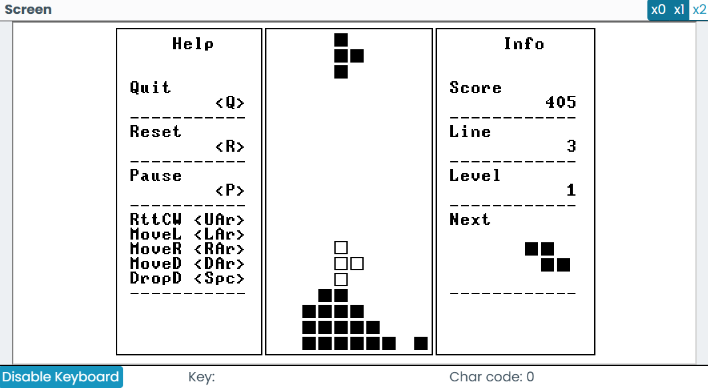

# Nand2Tetris

All tests passed.

## Development Environment

OS:

- Windows 11 10.0.26100

Programming Language

- Python 3.13.7  

Code Editor

- VS Code 1.104.0

VS Code Plugins:

- [Nand2tetris jack language server](https://marketplace.visualstudio.com/items?itemName=roman-lukash.nand2tetris-jack-language-server)
- [Nand2Tetris IDE](https://marketplace.visualstudio.com/items?itemName=AvivYaish.nand-ide)
